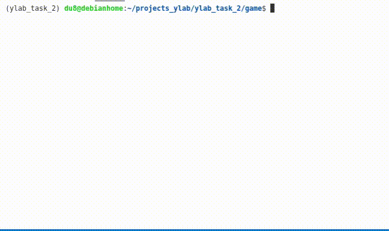

# Tic tac toe

Игра "Обратные крестики-нолики"

## Описание

Программная реализация игры

### Особенности

- постановка задачи:

Разработать игру «Обратные крестики-нолики» на поле 10 x 10 с правилом «Пять в ряд» – проигрывает тот,
у кого получился вертикальный, горизонтальный или диагональный ряд из пяти своих фигур (крестиков/ноликов).

Игра должна работать в режиме «человек против компьютера».

- статус проекта: учебный

## Пример работы




### Используемые технологии

* [Numpy](https://numpy.org/doc/)
* [tabulate](https://pypi.org/project/tabulate/)

## Требования к окружению

* Python 3.7 и выше,
* Linux/Windows

## Установка

- Клонировать проект:
```sh
git clone https://github.com/Padking/tic-tac-toe.git
cd tic-tac-toe/game
```
- Запустить программу:
```sh
python tic_tac_toe.py
```

### Пример запуска

```sh
$ python tic_tac_toe.py -h
usage: tic_tac_toe.py [-h] [{x,o}]

Игра "Обратные крестики-нолики". Право первого хода за пользователем.

positional arguments:
  {x,o}       Роль (за кого Вы): x или o. По умолчанию: x

optional arguments:
  -h, --help  show this help message and exit
```

```sh
$ python tic_tac_toe.py

Вы играете роль 'x'.
Начинаем игру!

+----+----+----+----+----+----+----+----+----+-----+
|  1 |  2 |  3 |  4 |  5 |  6 |  7 |  8 |  9 |  10 |
+----+----+----+----+----+----+----+----+----+-----+
| 11 | 12 | 13 | 14 | 15 | 16 | 17 | 18 | 19 |  20 |
+----+----+----+----+----+----+----+----+----+-----+
| 21 | 22 | 23 | 24 | 25 | 26 | 27 | 28 | 29 |  30 |
+----+----+----+----+----+----+----+----+----+-----+
| 31 | 32 | 33 | 34 | 35 | 36 | 37 | 38 | 39 |  40 |
+----+----+----+----+----+----+----+----+----+-----+
| 41 | 42 | 43 | 44 | 45 | 46 | 47 | 48 | 49 |  50 |
+----+----+----+----+----+----+----+----+----+-----+
| 51 | 52 | 53 | 54 | 55 | 56 | 57 | 58 | 59 |  60 |
+----+----+----+----+----+----+----+----+----+-----+
| 61 | 62 | 63 | 64 | 65 | 66 | 67 | 68 | 69 |  70 |
+----+----+----+----+----+----+----+----+----+-----+
| 71 | 72 | 73 | 74 | 75 | 76 | 77 | 78 | 79 |  80 |
+----+----+----+----+----+----+----+----+----+-----+
| 81 | 82 | 83 | 84 | 85 | 86 | 87 | 88 | 89 |  90 |
+----+----+----+----+----+----+----+----+----+-----+
| 91 | 92 | 93 | 94 | 95 | 96 | 97 | 98 | 99 | 100 |
+----+----+----+----+----+----+----+----+----+-----+
Введите номер клетки для заполнения: 
```

```sh
$ python tic_tac_toe.py o

Вы играете роль 'o'.
Начинаем игру!

+----+----+----+----+----+----+----+----+----+-----+
|  1 |  2 |  3 |  4 |  5 |  6 |  7 |  8 |  9 |  10 |
+----+----+----+----+----+----+----+----+----+-----+
| 11 | 12 | 13 | 14 | 15 | 16 | 17 | 18 | 19 |  20 |
+----+----+----+----+----+----+----+----+----+-----+
| 21 | 22 | 23 | 24 | 25 | 26 | 27 | 28 | 29 |  30 |
+----+----+----+----+----+----+----+----+----+-----+
| 31 | 32 | 33 | 34 | 35 | 36 | 37 | 38 | 39 |  40 |
+----+----+----+----+----+----+----+----+----+-----+
| 41 | 42 | 43 | 44 | 45 | 46 | 47 | 48 | 49 |  50 |
+----+----+----+----+----+----+----+----+----+-----+
| 51 | 52 | 53 | 54 | 55 | 56 | 57 | 58 | 59 |  60 |
+----+----+----+----+----+----+----+----+----+-----+
| 61 | 62 | 63 | 64 | 65 | 66 | 67 | 68 | 69 |  70 |
+----+----+----+----+----+----+----+----+----+-----+
| 71 | 72 | 73 | 74 | 75 | 76 | 77 | 78 | 79 |  80 |
+----+----+----+----+----+----+----+----+----+-----+
| 81 | 82 | 83 | 84 | 85 | 86 | 87 | 88 | 89 |  90 |
+----+----+----+----+----+----+----+----+----+-----+
| 91 | 92 | 93 | 94 | 95 | 96 | 97 | 98 | 99 | 100 |
+----+----+----+----+----+----+----+----+----+-----+
Введите номер клетки для заполнения: 
```
